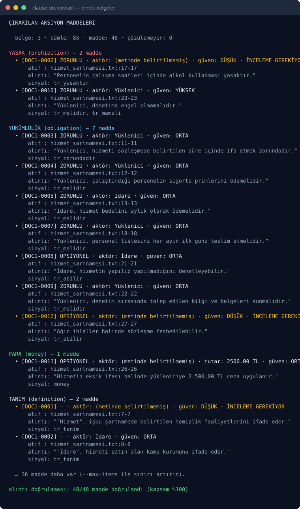

# clause-cite

[](https://github.com/acar32furkan-glitch/clause-cite/actions/workflows/ci.yml)
[](https://www.python.org/)
[](LICENSE)
[](https://docs.astral.sh/ruff/)
[](https://mypy-lang.org/)

[Türkçe](README.md) · **English**

**A deterministic CLI that turns contract, regulation and tender text into cited action items.** Every
item carries a **verbatim quote + a `file:line` range**; anything that cannot be shown as a quote is
not emitted. No network, no LLM, injected clock.

> ⚖️ **This tool is NOT legal advice.** clause-cite only extracts structured items (obligation,
> prohibition, deadline, money, document requirement, definition) from a text and links each one back
> to its source. It does not interpret the document, carries no legal effect and is not a substitute
> for legal opinion. The final assessment belongs to a qualified lawyer (see [SECURITY.md](SECURITY.md)).

No credentials, no network, see it in 30 seconds:

```bash
git clone https://github.com/acar32furkan-glitch/clause-cite && cd clause-cite
uv sync --all-extras --dev
uv run clause-cite extract examples/data/*.txt --anchor 2026-01-01
```

> `--anchor` is **required** and injects the clock: a relative deadline ("within 30 days") only
> resolves against an anchor date. Without an anchor, relative durations stay `unresolved` — they are
> not invented. Because we read neither the network nor the clock, the same input plus the same anchor
> always produces the same output.



> Item messages and docs are Turkish on purpose: the people reading the report are the legal/ops
> team. Code, field names, item-kind identifiers and CLI flags are English.

---

## Why

Contracts, regulations and tenders are full of obligations but are a mess for the human eye: "delivery
within 30 days" in one clause, "0.5% daily penalty for delay" in another, "the policy shall be
submitted as an annex" in a third. Pulling these out by hand is slow and error-prone; asking a summary
tool to summarise them is dangerous — because **a summary produces sentences you cannot quote.**

clause-cite solves this deterministically:

- **No item without a quote.** Every item carries the **verbatim text** from the source and its
  `file:line` range; the `verify` command proves this invariant. Anything that cannot be shown is not
  emitted (see [ADR-0001](docs/adr/0001-citation-invariant.md)).
- **Modality is preserved.** `must` / `should` / `may` are **never merged**; ambiguity stays visible.
  The difference between "should" and "must" has legal consequences
  (see [ADR-0002](docs/adr/0002-modality-preserved.md)).
- **Nothing is invented.** If the actor or the date cannot be extracted from the text it stays
  `unresolved`; the system does not fill gaps by guessing. When unsure, an item is flagged
  `needs_review`.

## Kinds (`ItemKind`)

| Kind (code) | Turkish | What it catches |
|-------------|---------|-----------------|
| `obligation` | **YÜKÜMLÜLÜK** | Imposes something a party must do ("shall", "must", "...mak zorundadır", "-melidir") |
| `prohibition` | **YASAK** | Forbids an action ("shall not", "must not", "...amaz") |
| `deadline` | **TERMİN** | A date or duration limit ("within 30 days", "no later than ...", "en geç") |
| `money` | **PARA** | Amount, penalty, payment ("10,000 TRY", "0.5% late penalty", "penalty of") |
| `document_required` | **BELGE_ZORUNLU** | A duty to submit a document ("shall submit", "must be submitted", "sunulması zorunludur") |
| `definition` | **TANIM** | A term definition ("means", "refers to", "... olarak ifade edilir") |
| `ambiguous` | **BELİRSİZ** | A pattern matched but no kind/modality decision could be made — always `needs_review` |

Kind mappings and signal patterns: **[docs/rules.md](docs/rules.md)** (Turkish).

## Modality

| Signal | Turkish | Example surface forms |
|--------|---------|-----------------------|
| `must` | **ZORUNLU** | "shall", "must", "...mak/-mek zorundadır", "-melidir / -malıdır", "gerekir" |
| `should` | **ÖNERİLEN** | "should", "-meli / -malı", "önerilir / tavsiye edilir" |
| `may` | **OPSİYONEL** | "may", "is entitled to", "...abilir/-ebilir", "hakkı vardır" |

When a sentence carries more than one signal the **strongest wins**, with the precedence
`prohibition > obligation > permission`; that conflict is also surfaced on the item as
`needs_review`. Modality is never dropped or reduced to a merged value.

## Confidence and `needs_review`

| Confidence | Turkish | Meaning |
|------------|---------|---------|
| `HIGH` | YÜKSEK | Pattern is clear; actor and date/amount were resolved from the text |
| `MEDIUM` | ORTA | Pattern is clear but the actor **or** the date/amount could not be resolved |
| `LOW` | DÜŞÜK | Weak pattern, unresolvable actor/date; the decision is uncertain |

An item is flagged `needs_review` when: the actor cannot be extracted; a relative deadline exists but
`--anchor` is missing (the date stays `unresolved`, the raw text is kept); or confidence is `LOW`
(including `ambiguous` kinds). `needs_review` is **a quiet warning**, not a hidden one — the flag
points at the spot a human must look at.

## Commands

```bash
uv run clause-cite extract examples/data/*.txt --anchor 2026-01-01   # extract items
uv run clause-cite verify  examples/data/*.txt                        # prove the citation invariant
uv run clause-cite eval    examples/golden                            # golden-set regression
uv run clause-cite kinds                                              # kind and modality mapping
uv run clause-cite --version
```

`extract` flags:

| Flag | Meaning |
|------|---------|
| `--anchor YYYY-MM-DD` | Anchor date that resolves relative durations (injected clock) |
| `--json` | JSON contract for agents/CI |
| `--report out.json` | Write the JSON report to a file |
| `--csv out.csv` | Export the item table as CSV |
| `--fail-on-unresolved` | Exit with code 1 if any `unresolved` or `needs_review` item exists |
| `--strict` | Zero tolerance for ambiguity: `ambiguous`/`LOW` items raise the exit code |
| `--max-items N` | Limit output to the first N items |
| `--github-summary` | Append a Markdown report to the Actions job summary |
| `--lang auto\|tr\|en` | Signal-dictionary language (default `auto`: detected from the document) |

## Exit codes

| Code | Meaning |
|------|---------|
| `0` | Clean (valid extraction, policy satisfied) |
| `1` | `--fail-on-unresolved` (or `--strict`) policy failed, or a **citation-invariant violation** |
| `2` | Input error (unreadable file, broken encoding, invalid `--anchor` format) |

## Using it in CI

```yaml
- name: Extract contract items
  run: uv run clause-cite extract content/sozlesme.txt --anchor 2026-01-01 --fail-on-unresolved --github-summary
```

`--fail-on-unresolved` makes the command exit **1** when an unresolved item exists, breaking the PR;
`--github-summary` appends a Markdown report to the job summary. Example workflow:

```yaml
name: Clause cite
on:
  pull_request:
    paths: ["content/**.txt"]

jobs:
  items:
    runs-on: ubuntu-latest
    steps:
      - uses: actions/checkout@v4
      - uses: astral-sh/setup-uv@v5
        with:
          enable-cache: true
      - run: uv sync --all-extras --dev
      - name: Extract (citation required)
        run: >
          uv run clause-cite extract content/*.txt
          --anchor 2026-01-01 --fail-on-unresolved --github-summary
```

## Architecture

```text
examples/data/*.txt  ─→ text.py ─→ extract.py ─→ Item ─→ verify.py ─→ render/cli
 (document text)       (segment)    (patterns)  (citation) (invariant)   (report)
```

- The extraction layer is a **pure function**: no IO, no clock, no randomness; time is injected via
  `anchor`.
- Every `Item` carries a `source`: the verbatim quote plus `(file, line_start, line_end)`.
- `verify` runs independently: it **proves** the output still matches the source.
- Details: [docs/architecture.md](docs/architecture.md) · decisions: [docs/adr/](docs/adr/)

## Quality

```bash
uv run ruff check . && uv run ruff format --check .
uv run mypy                              # strict
uv run pytest --cov=clause_cite --cov-report=term-missing --cov-fail-under=85
uv run clause-cite verify examples/data/*.txt   # citation invariant
```

`ruff` + `ruff format` + `mypy --strict` clean · CI: Python 3.12 and 3.13 matrix plus an "extraction
demo" job (citation and `file:line` format, exit code and `verify` are asserted). The interpreter that
CI actually installs is verified inside the job, so a matrix entry running the wrong Python turns red
instead of passing silently.

## Limits

- **It does not give legal advice.** The extracted items are a structured view of a text; not legal
  opinion, interpretation or consequence. This tool is not a substitute for a lawyer.
- **It does not invent.** Missing actor/date stays `unresolved`; relative durations do not resolve
  without an anchor.
- **It does not merge.** `must`/`should`/`may` and `prohibition`/`obligation` stay distinct.
- **No LLM.** It extracts with patterns; when unsure it marks `needs_review` and stays silent.
- **It does not modify the document.** It only reads and reports; it writes to no external system.

## Contributing

[CONTRIBUTING.md](CONTRIBUTING.md) · [CODE_OF_CONDUCT.md](CODE_OF_CONDUCT.md) ·
[SECURITY.md](SECURITY.md) · changes: [CHANGELOG.md](CHANGELOG.md)

## License

[MIT](LICENSE) © 2026 Furkan Acar (acar32furkan-glitch)
