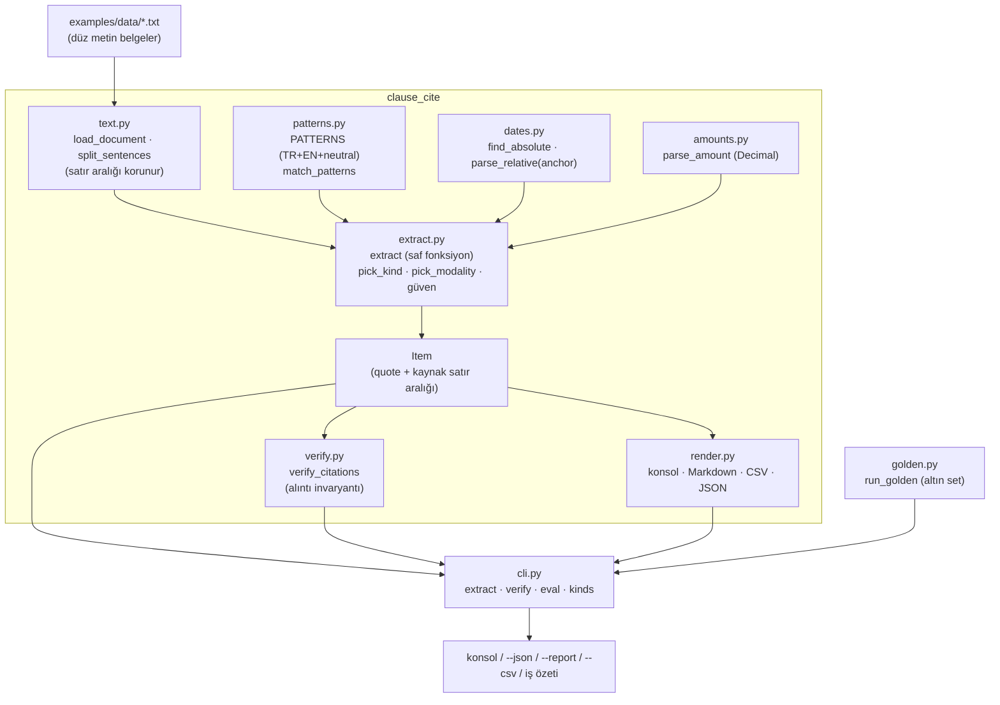

# Mimari

Tek yönlü akış: **girdi (belge) → bölütleme → kalıp eşleme → tür/kip kararı → zenginleştirme →
alıntı doğrulaması → çıktı**. Hiçbir katman ağa çıkmaz, saati okumaz veya rastgelelik kullanmaz
(`anchor` dışarıdan verilir); bu yüzden aynı belge + aynı `anchor` her zaman aynı maddeleri üretir.

## Katmanlar

| Modül | Sorumluluk | Notlar |
|-------|-----------|--------|
| `models.py` | Veri modelleri (`Document`, `Sentence`, `Item`, `ExtractionResult`) ve kod sabitleri (`ItemKind`, `Modality`, `Confidence`) | Her `Item` birebir `quote` + `citation` (dosya:satır-satır) taşır; kullanıcıya dönük etiketler `label_tr` |
| `text.py` | Belge yükleme (`.txt`/`.md`) ve cümle bölütleme | Kısaltma ve sayı istisnaları; her cümlenin metni kaynak satırın birebir parçasıdır |
| `patterns.py` | Veri güdümlü kalıp kataloğu (TR + EN + `neutral`) | Kalıplar davranış koda gömülü değildir; `clause-cite kinds` kataloğu doğrudan basar |
| `dates.py` | Mutlak tarih ve göreli termin çözümü | Anchor yoksa tarih `None`; göreli ham metin (`due_raw`) korunur — **uydurma yok** |
| `amounts.py` | Tutar çözümü (`Decimal`, TR/EN biçimleri) | Para birimi kaynakta geçtiği hâliyle; float'a düşülmez |
| `extract.py` | Çıkarım motoru (saf fonksiyon) | Tür ve kip önceliği, aktör/tarih/tutar zenginleştirmesi, güven skoru |
| `verify.py` | **Alıntı invaryantı** denetimi | `verify_citations` her maddenin `quote`'unu kaynak satır aralığına karşı doğrular; `citation_coverage` oran verir |
| `render.py` | İnsan ve makine çıktısı | Türkçe konsol, Markdown/CSV/JSON ve GitHub iş özeti |
| `golden.py` | Altın set regresyonu | İki yönlü karşılaştırma: eksik **ve** fazladan madde hatadır |
| `cli.py` | Komutlar ve çıkış kodları | `0` temiz · `1` politika/invariyant düştü · `2` girdi hatası |

## Neden alıntı invaryantı ayrı bir katman (`verify.py`)?

Çıkarım motoru doğru olabilir; ama **kanıt** olmadan bu doğruluk varsayımdır. `verify.py` çıkarımdan
**bağımsız** çalışır: her maddenin `quote`'unu, işaret ettiği `start_line..end_line` aralığındaki
satırların birleşiminde (yalnızca beyaz boşluk normalizasyonuyla) arar. Bulamazsa bu bir uyarı değil
**ihlaldir** ve çıkış kodu `1` olur. Böylece "motor bir gün sessizce yanlış bir cümle üretirse" CI
kırmızıya döner (bkz. [ADR-0001](adr/0001-citation-invariant.md)).

## Tür ve kip kararı

Aynı cümlede birden çok kalıp eşleşebilir. İki bağımsız öncelik uygulanır:

- **Tür önceliği** (`KIND_PRIORITY`): yasak > belge zorunluluğu > yükümlülük > termin > para > tanım >
  belirsiz. Yani güçlü bir hüküm, zayıf bir gözlemi yutar.
- **Kip önceliği** (`MODALITY_PRIORITY`): `must` > `should` > `may`.

Kip **asla birleştirilmez**: eşleşen **tüm** kalıp sinyalleri `Item.signals` alanına yazılır, böylece
karar görünür kalır. Kip çakışması veya belirsizlik `needs_review` olarak işaretlenir
(bkz. [ADR-0002](adr/0002-modality-preserved.md)).

## Güven skoru

`score_confidence`, bağımsız sinyal sayısı ile netleşen aktör/tarih/tutar durumundan bir puan üretir:
çözülen aktör ve tarih/tutar puanı yükseltir; çözülemeyen göreli tarih ve çözülemeyen taraf puanı
düşürür. Sonuç `HIGH`/`MEDIUM`/`LOW`'dur ve `LOW` ya da çözülemeyen bir alan varsa madde
`needs_review` alır.

## Determinizm garantisi

- Zaman `anchor` parametresiyle dışarıdan verilir; `dates.parse_relative` bu yüzden `anchor` alır.
- Kalıp kataloğu `patterns.py` içinde **veri** olarak durur; sıra ve dil filtresi sabittir.
- Madde kimlikleri (`DOC<n>-<sıra>`) belge sırasına göre deterministik üretilir.
- `--strict` yalnızca `HIGH` güvenli maddeleri döndürür; elenenler `stats["eliminated"]` içinde
  sayılır — sessizce yok olmaz.
- Tüm bu davranışlar `tests/` ve `examples/golden` içinde determinizm sözleşmesi olarak sabitlenmiştir.

## Genişletme noktaları

1. **Yeni kalıp:** `patterns.py` içindeki `PATTERNS` demetine bir kayıt ekle (düzenli ifade + tür +
   kip + sinyal). Motor değişmez; `docs/rules.md` tablosunu ve altın seti güncelle
   (adımlar: [CONTRIBUTING.md](../CONTRIBUTING.md)).
2. **Yeni çıktı biçimi:** `render.py` içine bir fonksiyon ekle; `cli.py`'de bayrağa bağla.
3. **CI'ya bağlama:** `clause-cite extract ... --json --fail-on-unresolved --github-summary`
   çıktısını kullan; JSON sözleşmesi `render_json_payload` ile sabitlenmiştir.
